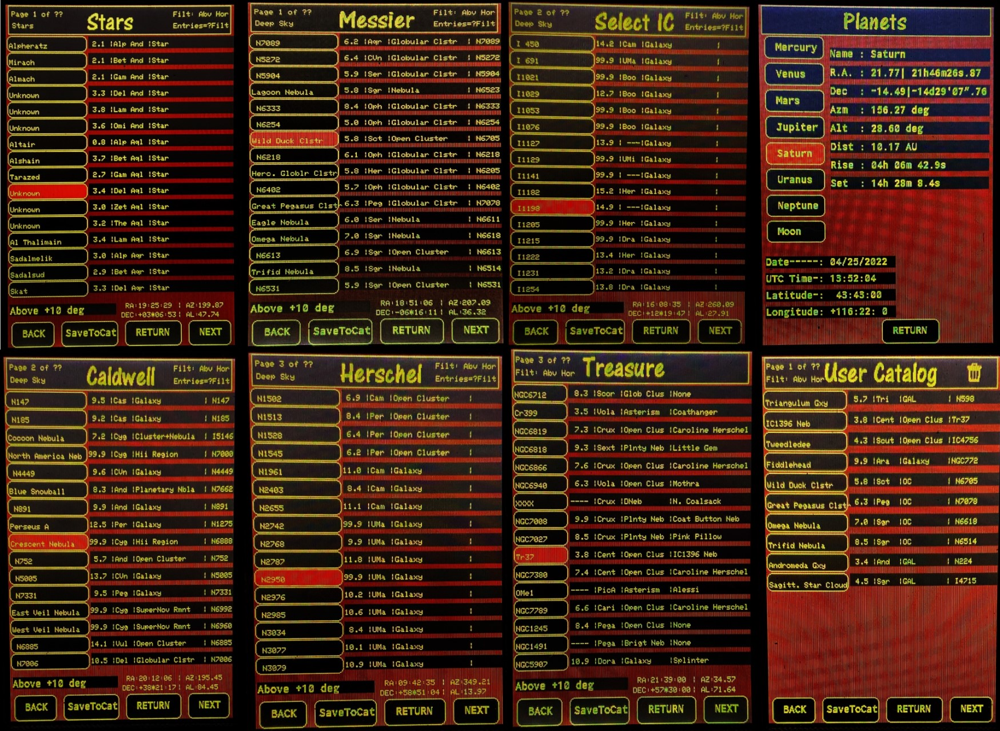

# DDScope

Direct Drive Telescope - A servo controlled F4.5 13" ALT/AZ GoTo Newtonian Telescope

* Author: Richard Benear 3/2021 - 4/2022

The DDScope firmware implementation includes OnStep FW by Howard Dutton.

OnStep is FW for a GoTo telescope controller by Howard Dutton (and others)
and was designed primarily for Stepper Motors, although the recent version
(OnStepX) appears to support Servos.

DDScope Catalogs were leveraged from the catalog code from Smart Hand Controller
that is used with OnStep.

DDScope doesn't use Stepper motors or gears. DDScope uses 3-phase
Axial Flux Permanent Magnet DC Motors (AFPMDC Motor) (aka Direct Drive).
Additionally, there is closed loop Servo control of motor positions using
an ODrive subsystem and 2^14 (16,384 tick absolute encoders. The Motors,
Electronics, and Mechanics were designed and constructed by the author.
Motor closed-loop control is handled by the ODrive subsystem using a serial
command channel from DDScope.

A menu and pages (screens) structure using a 3.5" LCD touchscreen is
implemented. The 3.5" Display is an electrically modified Rasperry Pi TFT LCD using the
SPI interface over an HDMI cable.

## DDScope specific files and libraries

### IDE - VSCode / PlatformIO

### Files Created

* **src/DDScope.ino (modified version of original OnStep.ino)**  
  * TouchScreen.ino  
  * HomePage.ino
    * GuidePage.ino
    * FocuserPage.ino
    * GotoPage.ino
    * MorePage.ino
      * SettingsPage.ino
      * OdrivePage.ino
        * ExtStatusPage.ino (only accessible from ODrive page)
      * AlignPage.ino
      * CatalogPage.ino
        * PlanetsPage.ino
* src/ODriveArduino/OdriveDriver.h
* src/Display/Display.h
* src/Display/DisplayCommon.h
* src/Display/icons.c
* include/pinmaps/Pins.DDT.h
* include/OnStep/Config.h
* include/SDcard/mod1_treasure.csv
* include/SDcard/NGC1566.bmp

### Key Libraries and packages

* Onstep Firmware  
    Author: [Howard Dutton](http://www.stellarjourney.com)
* Multiple celestial catalogs using catalog portion of Smart Hand Controller(SHC)  
    Author: [Charles Lemair](https://pixelstelescopes.wordpress.com/teenastro)  
    Author: [Howard Dutton](http://www.stellarjourney.com)
* Planet catalog using Ephermeris Software  
    Author: [Sebastien MARCHAND](www.marscaper.com)
* A catalog of sky "Treasures" from rDUINOScope on micro SD card  
    Author: Dessislav Gouzgounov (Desso)  
    PROJECT [Website](http://rduinoscope.byethost24.com)  
    Original file has been formatted differently for DDScope
* _Adafruit_ILI9486_Teensy_ by Steve Strong & Richard Palmer
* include/DDFonts/   _(various supporting fonts)_
* include/DDCatalog/  _(Catalog support .h files from Smart Hand Controller)_
* include/Catalogs/   _(all Catalog .h files from Smart Hand Controller)_

### libdeps\teensy41 (imported libraries)

* Adafruit BME280 Library
* Adafruit BusIO
* Adafruit GFX Library
* Adafruit Unified Sensor
* Ephemeris
* TimedAction
* TinyGPSPlus

## Features

DDScope supports a subset of all the OnStep features.

### OnStep Features Supported

* ESP32 WiFi  
* GPS using BN220 (also support for BS280 (PPS signal input))  
* Temperature, Humidity, Pressure using BME280 sensor
* Remote DC Focuser control (modified OnStep code)
* ASCOM driver works with Stellarium (haven't tested others)
* Android App is functional
* iPhone App Gotomote is functional
* Not implemented: Ethernet (could be added with Wiznet 5500 shield)
* Not Implemented: Bluetooth (could be enabled)

### DDScope Features

#### Touchscreen LCD Menu Pages

* Home (HomePage.ino)
* Guide (GuidePage.ino)
* Focuser (FocuserPage.ino)
* GoTo (GotoPage.ino)
* Catalogs & More (MorePage.ino)
  * Catalogs (CatalogPage.ino)
    * General Stars
    * Messier
    * Caldwell
    * Herschel
    * IC
    * Planets (PlanetsPage.ino)
    * Treasure
    * Custom User
* ODrive (OdrivePage.ino)
* Extended Status (ExtStatusPage.ino)
* Settings (SettingPage.ino)
* Alignment (AlignPage.ino)

### Telescope Hardware

* Complete mechanical design, including DC motors, done in FreeCAD
* 3D printed: 2/3 of mechanical design is 3D printed (carbon fiber PLA, PLE, ABS) (the rest is steel or Alum.). Used a Sidewinder X1 3D printer.
* ALT/AZ design using NEWT online software
* Optics: 13" Dia. f4.5 primary mirror from an ancient Obsession Scope
* Direct Drive 3-phase axial flux DC permanent magnent motors for both axis (AZM/ALT)
  * ALT motor is double motor for higher torque with two stators sandwiching a single rotor
  * AZ motor is a single motor built around 2 slew bearings
  * ALT/AZ motors are approx. 11" in diameter to get needed torque
* Closed loop control using CUI AMT23B Absolute encoders (16,384) for ALT and AZM axis
* Floating mirror cell design using 3D printed materials and Plop Cell Design SW
* Curved Vane Spyder for Secondary made by [1800Destiny](http://www.1800destiny.com/)
* Moonlight Focuser(DC motor) control with Focuser Page on Touchscreen

### Telescope Electronics

* Teensy 4.1 primary CPU running 600 Mhz with Micro SD card storage
* ODrive 24 VDC motor controller board with open source firmware
* WiFi using ESP32 (Bluetooth not enabled)
* GPS (Lat, Long, Time, Date, Altitude)
* Temperature, Humidity, pressure, altitude
* Temperature Sensors monitoring inside DC Motors
* DC Motor current monitoring
* Dynamic Gain control of DC Motors
* Fan control
* 22.2 VDC LiPo Battery 5200 mAh
* Custom PC Board designed with KiCAD with spares pinned out
* 3.5" TFT LCD (Rpi) display with Touchscreen (modified to work on 3.3V and 16 bit SPI interface)

### Other DDScope features

* Slew rate of 7 deg/sec. Trapezoidal move profile.
* The ability to store favorite objects from any catalog (except planets) to a Custom User Catalog on micro SD card
* Above Horizon filter for catalogs. All Sky Align Filter for Star Catalog.
* Display of target coordinates and real time updates of slewing coordinates
* Ability to set latitude, longitude, time, date, UTC when GPS is down
* Battery low warning (visual and auditory) plus battery voltage reading
* Real time ALT/AZ Encoder readings
* Night Mode for display/screen
* OnStep errors and ODrive errors displayed
* Auditory frequency-based feedback when either axis is being displaced from target (loaded)

## Other Documentation

* DDScope: In process...
* OnStep: Detailed documentation, including the full set of features, detailed designs for PCBs, instructions on how to build a controller, how to configure the firmware for your particular mount, can all be found the [OnStep Group Wiki](https://groups.io/g/onstep/wiki/home).

## Change Log

* DDScope changes: To be Determined...
* OnStep changes: All the changes are tracked in git, and a detailed list can be accessed using the following git command:  
        _git log --date=short --pretty=format:"%h %ad %<(20)%an %<(150,trunc)%s"_

## Support

* DDScope specific: To be determined...  
* OnStep specific: questions and discussion should be on the mailing list (also accessible via the web) at the [OnStep Group](https://groups.io/g/onstep/).

## License

DDScope and OnStep is open source free software, licensed under the GPL.  
See [LICENSE.txt](./LICENSE.txt) file.

## Images

### Menu Screens

### Catalog Screens

### DDScope Picture

